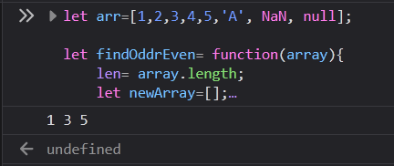
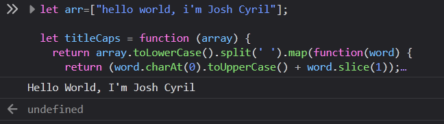

# Function and API

Generate an API key with given link below https://openweathermap.org/guide 

Print the current weather data in console- By lat lang [✔ Link]()

## Do the below programs in anonymous function and IIFE

   1. Print odd numbers in an array [🔽 Snippet Code](#1-print-odd-numbers-in-an-array)

   2. Convert all the strings to title caps in a string array [🔽 Snippet Code](#2-convert-all-the-strings-to-title-caps-in-a-string-array)

   3. Sum of all numbers in an array [✔ Link]()

   4. Return all the prime numbers in an array [✔ Link]()

   5. Return all the palindromes in an array [✔ Link]()

   6. Return median of two sorted arrays of same size [✔ Link]()

   7. Remove duplicates from an array [✔ Link]()

   8. Rotate an array by k times and return the rotated array. [✔ Link]()

---
   
### 1. Print odd numbers in an array
   
   ```js
    let findOddrEven= function(array){
    len= array.length;
    let newArray=[];
    for(i=0;i<len;i++){
        if(!isNaN(array[i])){
            if(array[i]%2 !== 0){
                newArray+= array[i]+' ';
            }
        }
    }
    return (newArray.slice(0,-1));
   };
   ```
   > [Read More](findOddrEven.js)   
   
   > Output [⬆ Top](#do-the-below-programs-in-anonymous-function-and-iife)
   
    

---
### 2. Convert all the strings to title caps in a string array
   
   ```js
      let titleCaps = function (array) {
         return array.toLowerCase().split(' ').map(function(word) {
            return (word.charAt(0).toUpperCase() + word.slice(1));
         }).join(' ');
      };
   ```
   > [Read More](titleCaps.js)   
   
   > Output [⬆ Top](#do-the-below-programs-in-anonymous-function-and-iife)
   
   
