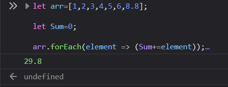
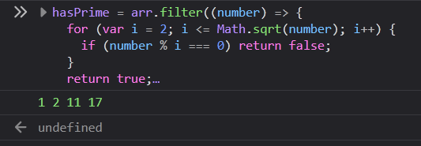
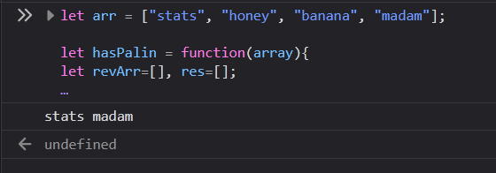
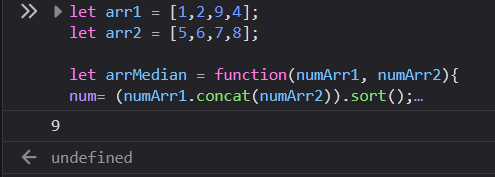
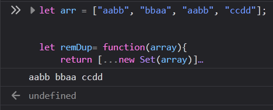
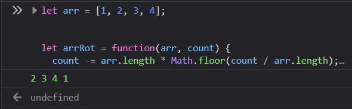

# Function and API

Generate an API key with (https://openweathermap.org/guide)

Print the current weather data in console- By lat lang [✔ Link]()

## Do the below programs in anonymous function and IIFE

   1. Print odd numbers in an array [🔽 Code Snippet](#1-print-odd-numbers-in-an-array)

   2. Convert all the strings to title caps in a string array [🔽 Code Snippet](#2-convert-all-the-strings-to-title-caps-in-a-string-array)

   3. Sum of all numbers in an array [🔽 Code Snippet](#3-sum-of-all-numbers-in-an-array)

   4. Return all the prime numbers in an array [🔽 Code Snippet](#4-return-all-the-prime-numbers-in-an-array)

   5. Return all the palindromes in an array [🔽 Code Snippet](#5-return-all-the-palindromes-in-an-array)

   6. Return median of two sorted arrays of same size [🔽 Code Snippet](#6-return-median-of-two-sorted-arrays-of-same-size)

   7. Remove duplicates from an array [🔽 Code Snippet](#7-remove-duplicates-from-an-array)

   8. Rotate an array by k times and return the rotated array. [🔽 Code Snippet](#8-rotate-an-array-by-k-times-and-return-the-rotated-array)

---
   
### 1. Print odd numbers in an array
   
   ```js
    let findOddrEven= function(array){
    len= array.length;
    let newArray=[];
    for(i=0;i<len;i++){
        if(!isNaN(array[i])){
            if(array[i]%2 !== 0){
                newArray+= array[i]+' ';
            }
        }
    }
    return (newArray.slice(0,-1));
   };
   ```
   > [Read More](findOddrEven.js)   
   
   > Output 
   
    [Top ⬆ ](#do-the-below-programs-in-anonymous-function-and-iife)

---
### 2. Convert all the strings to title caps in a string array
   
   ```js
      let titleCaps = function (array) {
         return array.toLowerCase().split(' ').map(function(word) {
            return (word.charAt(0).toUpperCase() + word.slice(1));
         }).join(' ');
      };
   ```
   > [Read More](titleCaps.js)   
   
   > Output
   
    [Top ⬆ ](#do-the-below-programs-in-anonymous-function-and-iife)

---
### 3. Sum of all numbers in an array
   
   ```js
    arr.forEach(element => (Sum+=element));
   ```
   > [Read More](arrSum.js)
   
   > Output
   
    [Top ⬆ ](#do-the-below-programs-in-anonymous-function-and-iife)

---
### 4. Return all the prime numbers in an array
   
   ```js
    hasPrime = arr.filter((number) => {
      for (var i = 2; i <= Math.sqrt(number); i++) {
         if (number % i === 0) return false;
      }
   return true;
   });
   ```
   > [Read More](arrPrime.js)   
   
   > Output
   
    [Top ⬆ ](#do-the-below-programs-in-anonymous-function-and-iife)

---
### 5. Return all the palindromes in an array
   
   ```js
   let hasPalin = function(array){
   let revArr=[], res=[];

   // reverse the letters in a word.
   for(let i=0;i<arr.length;i++){
    revArr+=(array[i].split('').reverse()).join('')+',';
   }
    newArr=revArr.slice(0,-1).split(',');

   // check for palindromes
   for(j=0; j<arr.length;j++){
    if(arr[j]===newArr[j]){
        res.push(arr[j]);
    }
   }
   return res; 
   };
   ```
   > [Read More](arrPalin.js)   
   
   > Output
   
    [Top ⬆ ](#do-the-below-programs-in-anonymous-function-and-iife)
   
---
### 6. Return median of two sorted arrays of same size
   
   ```js
   let arrMedian = function(numArr1, numArr2) {
    num = (numArr1.concat(numArr2)).sort();
    midEle = (num.length) / 2;
    midEle2 = midEle - 1;
   return (num[midEle] + num[midEle2] / 2).toFixed(0);
   };
   ```
   > [Read More](arrMedian.js)   
   
   > Output 
   
    [Top ⬆ ](#do-the-below-programs-in-anonymous-function-and-iife)

---
### 7. Remove duplicates from an array
   
   ```js
    let remDup = function(array) {
       return [...new Set(array)]
    }
   ```
   > [Read More](remDup.js)   
   
   > Output
   
    [Top ⬆ ](#do-the-below-programs-in-anonymous-function-and-iife)

---
### 8. Rotate an array by k times and return the rotated array
   
   ```js
   let arrRot=function(arr, count) {
      count -= arr.length * Math.floor(count / arr.length);
      arr.push.apply(arr, arr.splice(0, count));
      return arr;
   }
   ```
   > [Read More](arrRot.js)   
   
   > Output 
  
    [Top ⬆ ](#do-the-below-programs-in-anonymous-function-and-iife)
